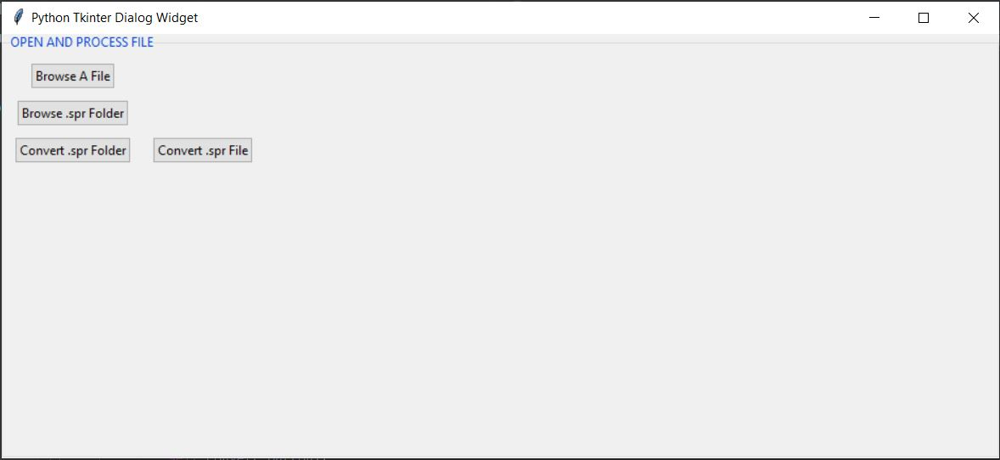
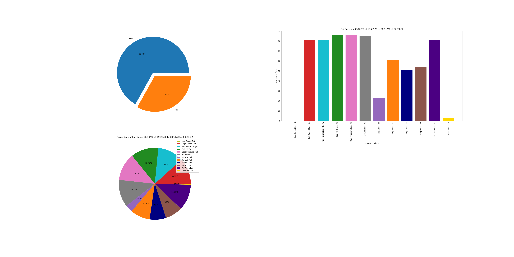

Presenting a program that can extract data from .spr files. It reads the data of all the variables in a .spr file, and write the data into an excel file. It also plots trend graphs of the variables and saves them as PDF files. The program comes with a user interface. The program can work on individual SPR files or on an entire folder of SPR files. Run the spr_to_excel_main.py file to start the UI. Once the UI appears, select either the "Browse .spr Folder" button or the "Browse .spr File button". To convert, press the "Convert .spr Folder" button to extract data from an entire fodler of SPR files, or click the "Convert .spr File" button to extract data from only individual SPR files. When the conversion is successful, it will automatically display the data in excel format and also show the graph trends in PDF files. 

